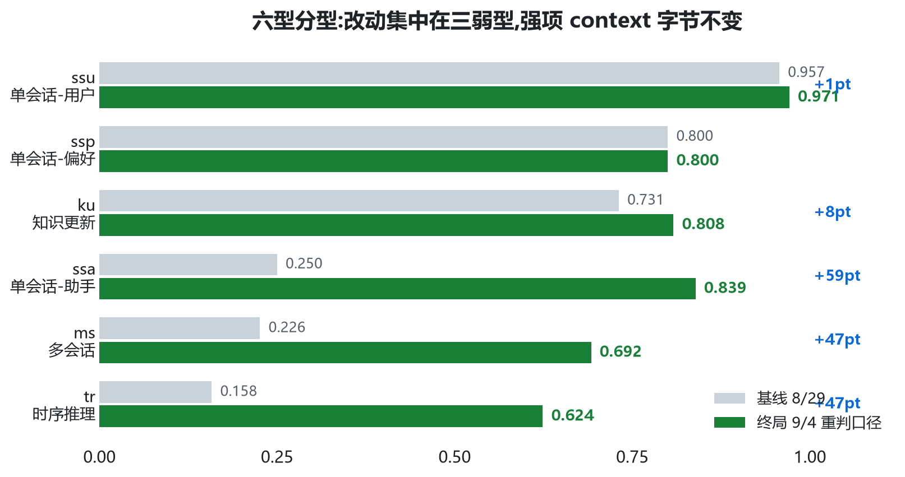
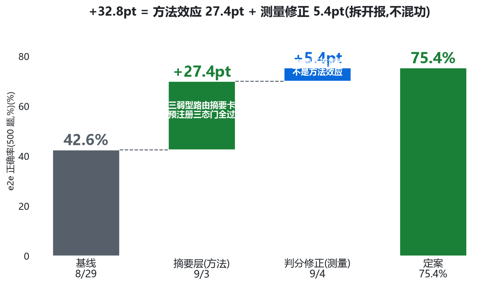
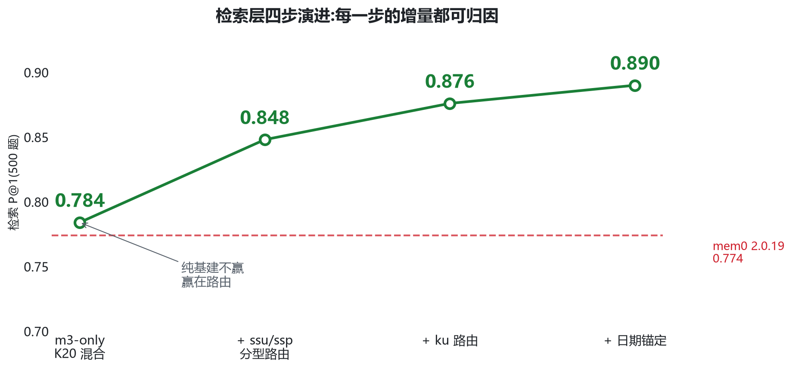
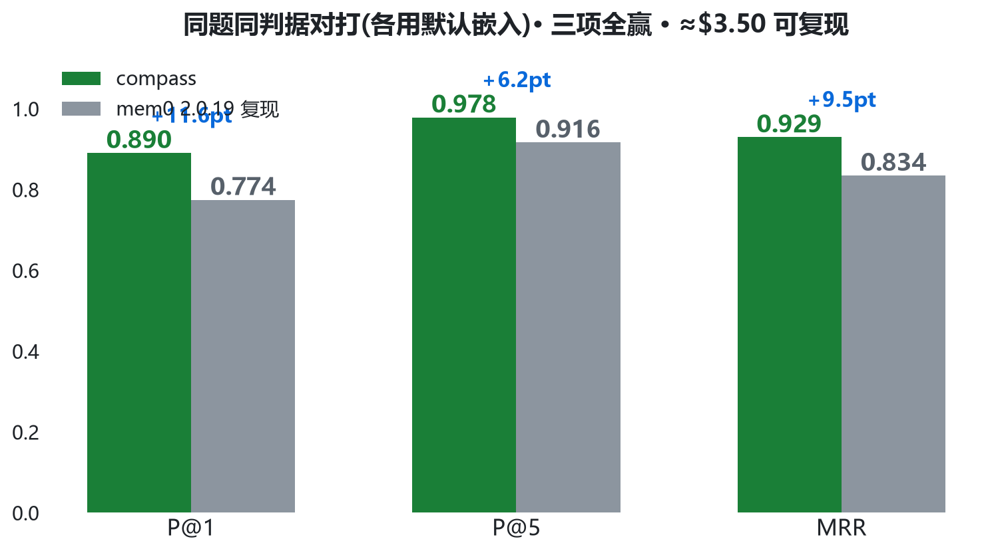
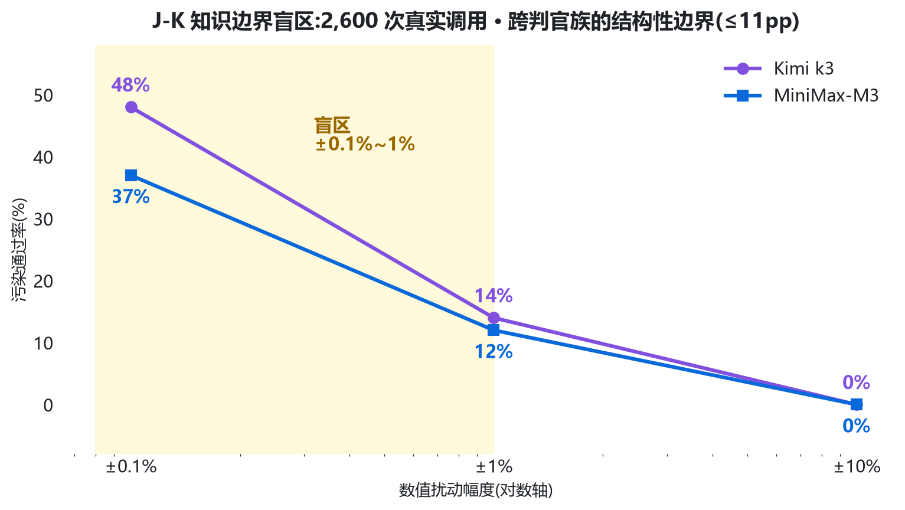
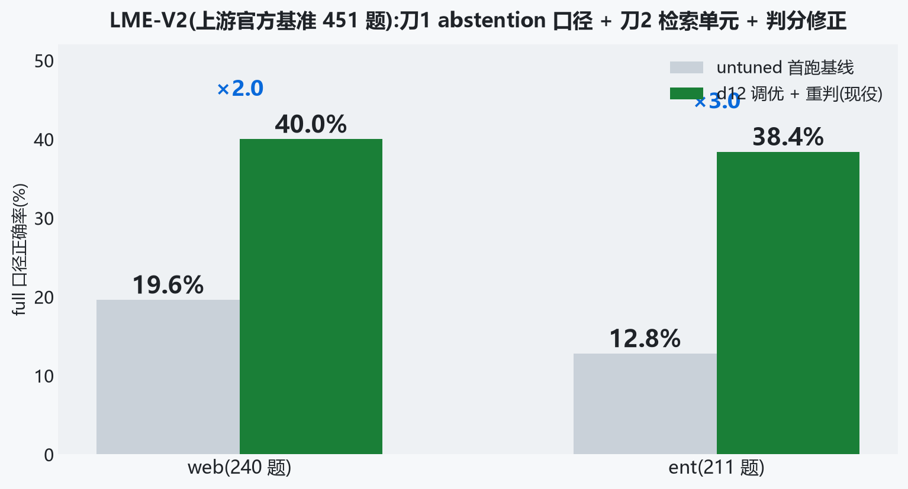
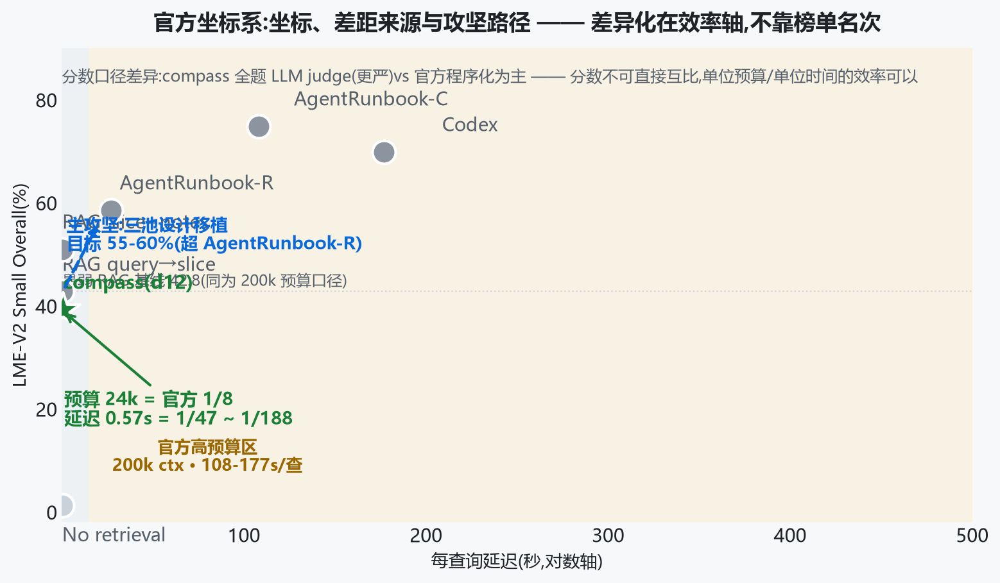
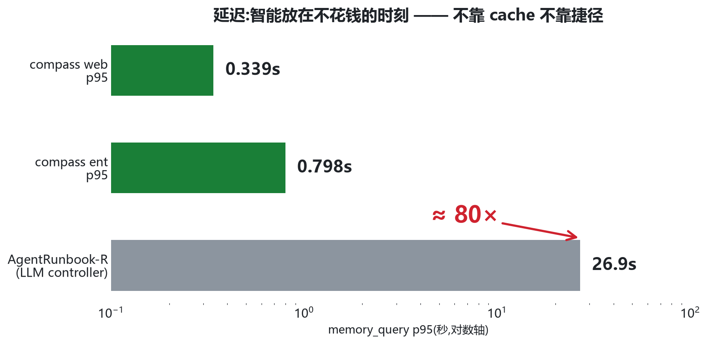

<!-- _paginate: false -->

<!-- _class: lead -->

# 不要为无法预测的未来<br>压缩过去

## nautilus-compass · agent 记忆层 · 技术深讲(30 分钟)

*Chunxiao Wang · 2026-09 · github.com/chunxiaoxx/nautilus-compass*

<div class="cards">
  <div class="card"><div class="num">0</div><div class="lbl">写入路径<br>LLM 调用数</div></div>
  <div class="card blue"><div class="num">42.6→75.4%</div><div class="lbl">LongMemEval-S e2e<br>500 题</div></div>
  <div class="card"><div class="num">80×</div><div class="lbl">检索延迟优势<br>p95 亚秒 vs 26.9s</div></div>
  <div class="card blue"><div class="num">5 次</div><div class="lbl">我们自己抓出的<br>判官事故</div></div>
</div>

<!-- 讲者注:开场 30 秒停顿,让四个数字被读完。今天目标:听众多带走三件事——
写入零 LLM 的架构赌注、判官三型病理学、以及我们怎么对待自己的数字。 -->

---

<!-- _class: part -->

<!-- _paginate: false -->

<div class="no">01</div>

# 第一幕 · 问题与立场

##### 写时压缩为什么在结构上必输

---

<div class="kicker">第一幕 · 问题与立场</div><div class="pageno">01 / 07</div>

# 你的 agent 正在忘记你


<!-- 讲者注:建立问题,不亮方案。问观众:你们的 agent 记得你上周说过什么吗?
ChatGPT 随对话推进覆写关键信息(ICLR 2025 基准论文人肉研究);长上下文直读掉 30-60%。 -->

---

<div class="kicker">第一幕 · 问题与立场</div><div class="pageno">01 / 07</div>

# 市场现状:三条路都堵了,基准作者早就说了

<div class="cols">
<div class="col">

| 策略 | 谁在做 | 有损决定在 |
|---|---|---|
| 压缩 | 多数 SaaS 记忆层 | **写入时** |
| 提炼/摘要 | mem0 / Zep / Letta | **写入时** |
| 裸读长上下文 | 直塞 context | 掉 30-60% |

**没有人把宝押在读取端**

</div>
<div class="col">

<div class="panel blue">

### ICLR 2025 · LongMemEval 基准论文(arXiv 2410.10813)

- §5.2:LLM 提炼的摘要/facts 替代原文 → **因信息丢失损害问答**
- 人肉研究:ChatGPT 压缩历史覆写关键信息
- 长上下文直读掉 30-60% → 记忆层的必要性由基准作者论证

</div>

</div>
</div>

> 写时压缩的损害 2024 年就被量化了;我们是第一波量出**读侧路线胜绩**的团队之一

<!-- 讲者注:左表指着"写入时"打两遍;右边是防"王婆卖瓜"——第三方基准作者先说的。 -->

---

<div class="kicker">第一幕 · 问题与立场</div><div class="pageno">01 / 07</div>

# 三不变量:写时压缩必输的结构原因

<div class="cols">
<div class="col">

<div class="panel">

### 1 · 未来查询不可知

重要性只在**被问到的时刻**显影。
同一份记忆,按题型换检索粒度:
P@1 **0.20 → 1.00**

变的不是记忆,是问题

</div>

</div>
<div class="col">

<div class="panel blue">

### 2 · 原文唯一可重索引

提炼物被冻结在当初那个
LLM 的认知水平;原文明天
可换更好嵌入、可作训练燃料

写时压缩把记忆**锁死在技术现状**

</div>

</div>
<div class="col">

<div class="panel red">

### 3 · 成本曲线方向反了

存储趋零、LLM 调用恒贵。
把便宜的(原文)换成
昂贵的(提炼物)= 逆曲线

写入免费是**自然结果**,非优化奇迹

</div>

</div>
</div>

<!-- 讲者注:不变量 2 那句"锁死在技术现状里"停两秒再翻页。 -->

---

<!-- _class: part -->

<!-- _paginate: false -->

<div class="no">02</div>

# 第二幕 · 架构

##### 出身 · 六层 · 写入端决策 · 负结果

---

<div class="kicker">第二幕 · 架构</div><div class="pageno">02 / 07</div>

# 反架构:写入零智能,读取全智能


<!-- 讲者注:强调"写入不调 LLM"停两秒。治理层是独有件(drift AUC 0.83+三层隔离+判分卫生学);
进化层三次实测 uplift=0,保持"待证"标注。 -->

---

<div class="kicker">第二幕 · 架构</div><div class="pageno">02 / 07</div>

# 写入端:出身与四条决策

<div class="panel blue">

**出身**:nautilus 智涌平台的 agent 舰队需要跨 agent 记忆层 → compass = 平台 Trinity 架构中**记忆与治理层**的独立开源形态,**不依赖平台即可完整运行**(本地三条命令)· 130 天 771 commits,603 由 agent 舰队提交

</div>

| 决策 | 内容 | 理由 |
|---|---|---|
| 存什么 | **原文 verbatim**(md+frontmatter) | 不变量 2:唯一可重索引 |
| 怎么索引 | 本地 BGE-m3 + BM25 + 日期元数据 | 词面扛标识符 / dense 扛语义 / 日期扛时序 |
| 不做什么 | **零 LLM**:不提炼、不建图、不摘要、不上云 | 不变量 1+3 |
| 质量门 | 经验胶囊写回需 reward ≥ 1.0 | 验证过的经验才入库,防跨 agent 复利成毒 |

> "不做什么"比"做什么"更难被抄 —— 因为它是立场,不是功能

<!-- 讲者注:出身一句带过,dogfood 结尾收。四条决策逐行过,最后一行是重点。 -->

---

<div class="kicker">第二幕 · 架构</div><div class="pageno">02 / 07</div>

# 架构决策记录:放弃过什么(负结果公开)

| 被放弃的方案 | 实测结果 | 教训 |
|---|---|---|
| 图数据库 Neo4j + graph rerank | 检索 **−6.2pt** | 图边引入噪声,复杂度做减法 |
| cross-encoder 重排器 | e2e **−2pt** | 嵌入自身排序已更好 |
| 大 K(50 vs 20) | **无差异** | 无重排时 K 只加宽融合窗口 |
| 小嵌入模型 Qwen3-0.6B | **wash**(P@5 0.833 vs 0.867) | 嵌入质量是检索地基 |
| LoRA 域适配嵌入 | 代理指标涨,e2e **平** | 预注册 +5pt 门没过就不上 |
| 主动拒答门(abstention) | 误拒 web 92 题(门 ≤1) | 打掉的是噪声,不是错误 |

<!-- 讲者注:这页是"系统与深度"的核心证据——每个负结果都真金白银跑出来,预注册文件带 hash 可查。
复杂度做减法不是品味,是被证伪逼出来的。 -->

---

<!-- _class: part -->

<!-- _paginate: false -->

<div class="no">03</div>

# 第三幕 · 算法解剖

##### 六型路由 · 归因链 · 检索演进 · 对打设置

---

<div class="kicker">第三幕 · 算法解剖</div><div class="pageno">03 / 07</div>

# 六型分型路由:改动集中在三弱型



<!-- 讲者注:设计逻辑一句话——用户陈述型答案通常在一个 user turn 里,检 turn 级;
跨会话/助手行为/时序型需要"每场会话发生了什么"的地图,路由到逐会话摘要卡。
强项(ssu/ssp/ku)context 字节不变;tr 62.4 是已知短板,主动讲。 -->

---

<div class="kicker">第三幕 · 算法解剖</div><div class="pageno">03 / 07</div>

# 归因链:42.6 → 75.4,每一步



<!-- 讲者注:全场最重要一页。把"方法带来多少"和"修测量仪带来多少"拆开报——
5.4pt 是仪器修复,不是方法效应,混报是评测写作最常见的自我欺骗。
预注册门:ms≥35%(锚22.6)/ ssa≥40%(锚25.0)/ tr≥30%(锚15.8),跑数前落仓带 hash。 -->

---

<div class="kicker">第三幕 · 算法解剖</div><div class="pageno">03 / 07</div>

# 三口径:同一次跑,三个数字

<div class="cards">
  <div class="card red"><div class="num">70.0%</div><div class="lbl">保守口径<br>71 题断连记为错答<br>(下界)</div></div>
  <div class="card"><div class="num">75.4%</div><div class="lbl">重判口径<br>同判官同 prompt 仅加重试<br>(发布口径)</div></div>
  <div class="card blue"><div class="num">81.6%</div><div class="lbl">干净口径<br>剔除 71 断连题 n=429<br>(上界)</div></div>
</div>

> 只报一个数 = 替听众做决定;三口径并报 = 把决定权还给听众

<!-- 讲者注:71/71 重判解决,其中 27 题翻对——注意"解决≠全变对",其余 44 题重判后仍是错答,
这正是"断连≠正确"的诚实注记。 -->

---

<div class="kicker">第三幕 · 算法解剖</div><div class="pageno">03 / 07</div>

# 检索层演进:赢在路由,不赢在嵌入



<!-- 讲者注:首版和 mem0 打平(0.784 vs 0.774)主动说——中间态如实公开是可信度的一部分。
四步每步增量都可归因;终局 P@5 0.978 / MRR 0.929 三项全赢。 -->

---

<div class="kicker">第三幕 · 算法解剖</div><div class="pageno">03 / 07</div>

# 检索对打:同题同判据,各用默认嵌入



<!-- 讲者注:设置逐字段——同 500 题(question_id join)/ retrieval-only 双方 / mem0 infer=False /
各用默认嵌入(我方 BGE-m3,mem0 侧 text-embedding-005)/ 版本钉死 mem0ai 2.0.19。
诚实披露:对方嵌入在部分单会话型更强,我们靠分型路由整体赢。
复现:scripts/reproduce_lmes_retrieval.sh,一条命令 ≈$3.50。 -->

---

<!-- _class: part -->

<!-- _paginate: false -->

<div class="no">04</div>

# 第四幕 · 判官病理学

##### 我们抓了自己判官 5 次 —— 全是配置问题,零次模型能力问题

---

<div class="kicker">第四幕 · 判官病理学</div><div class="pageno">04 / 07</div>

# 三型 taxonomy + 我们吃过的两次亏

部署中的判官 J\*(θ, B, I):知识边界 θ · 输出预算 B · 打分基础设施 I

| 型 | 耗尽的资源 | 检测信号 | 重试可治? | 对分数的效应 |
|---|---|---|---|---|
| **J-K** 知识边界 | θ 判别力 | Δ 探针集 | 否 | 静默放过错误 |
| **J-B** 输出预算 | B | 截断/空响应率 | 否 | 塌缩到默认标签 |
| **J-C** 连接 | I | 错误标签率 | **是** | 假性错答(下界) |

<div class="cards" style="margin-top:16px">
  <div class="card red"><div class="num" style="font-size:27px">事故① J-B</div><div class="lbl">4096 被思考吃满:ent <strong>146/211 题(69%)</strong>记 0 · 两轮调优被误判"未过门" · 重判后 web +3.3 / ent <strong>−1.9(方向相反!)</strong></div></div>
  <div class="card gold"><div class="num" style="font-size:27px">事故② J-C</div><div class="lbl">网关断连:<strong>71/500(14.2%)</strong>被静默记错 · 失真 5.4pt = 被测效应 32.8pt 的 <strong>1/6</strong> · 重判 71/71 解决(27 题翻对)</div></div>
</div>

> 机制不同、信号不同、解药不同 —— 混为一谈必然用错药

<!-- 讲者注:传统 judge bias 文献是"判官在读,但读歪了";我们这三型是"判官没在读 / 没来得及说 / 根本没被叫到"。
两次事故的共性:都是配置层,测量坏了方法背锅。 -->

---

<div class="kicker">第四幕 · 判官病理学</div><div class="pageno">04 / 07</div>

# J-K:数值精度盲区(2,600 次真实调用)



<!-- 讲者注:珠峰 8849→8949 米、光速 3.0→3.1×10⁸——±0.1% 的污染,四成通过。
盲区在"事实性要求已写入判分 prompt"前提下仍存在;换更强判官没用(跨族差 ≤11pp)。
判官能抓实体替换/常识错误(0% 通过)——是数值盲区,不是普遍轻信。
局限照讲:两判官均为 reasoning 模型,泛化未测;prompt 变体消融未做。 -->

---

<div class="kicker">第四幕 · 判官病理学</div><div class="pageno">04 / 07</div>

# 判分卫生协议 P1-P5(成本 ≈ 几次 API 调用)

| # | 例行 | 治哪种 |
|---|---|---|
| P1 | 跑数前冻结锚 / 门 / 裁决规则,版本化+hash | 裁决标准事后漂移 |
| P2 | 同判官重判+指数退避,只重试打分调用 | J-C 假性错答 |
| P3 | 保守 / 重判后 / 干净三口径并报 | 挑口径 |
| P4 | 部署冒烟:真实条目非空断言+预算审计 | J-B 截断塌缩 |
| P5 | n=30 上一题 = ±3.3pt,带内"回归"推迟审计 | 幻影回归 |

> 六相 checklist:部署前探针+冒烟 / 跑前预注册 / 跑中签名率监控 / 跑后重判+多口径

<!-- 讲者注:协议每个条款对应一次真实事故——5 次:401 变量名/断连/预算吃满/空响应/子型幻影回归。
全部配置层。测量可信度先于分数。paper2(arXiv 在投)是这一幕的正本。 -->

---

<!-- _class: part -->

<!-- _paginate: false -->

<div class="no">05</div>

# 第五幕 · 评测版图

##### 五战场组合 · LME-V2 调优 · 官方坐标系诚实定位

---

<div class="kicker">第五幕 · 评测版图</div><div class="pageno">05 / 07</div>

# 五个战场各测什么

| 战场 | 性质 | 回答的问题 | 结果 |
|---|---|---|---|
| LME-S e2e 500 题 | 自建 harness 主场 | 方法效应 | 42.6 → 75.4 |
| 检索对打 mem0 | 同题同判据 | 相对优势 | P@1 0.890 vs 0.774 |
| LOCOMO-10(n=1986) | 客场换数据集 | 泛化 | P@1 0.644 vs 0.592 |
| EverMemBench | 第三方公开榜 | 防自吹 | 44.4-47.3 vs Mem0 37.09 |
| LME-V2(451 题) | 上游官方基准 | 社区可比 | 40.0 / 38.4(untuned 19.6/12.8) |

> 单一战场都可被质疑;组合的覆盖面难以全部归为"自选有利"

<!-- 讲者注:EverMem 主动用首轮 44.4 作头条防挑样(Run2 47.3,CI 42.9-51.7);
不 claim SOTA。mem0 论文自报 94.4% 是 e2e LLM-judge 口径,跨 harness 不可比。 -->

---

<div class="kicker">第五幕 · 评测版图</div><div class="pageno">05 / 07</div>

# LME-V2:从 19.6/12.8 到 40.0/38.4



<!-- 讲者注:三步——刀1 abstention 判分口径(abstention 组 web 2.8→45.8 / ent 0→83.9,裸 UNKNOWN 252→0);
刀2 检索单元升级+预算 12k→24k(gold-在场 ent 0.115→0.652 倒挂修复);d13 判分修正(4096→16384 重判)。
刀3 LoRA 没进图:预注册门没过,未采纳——负结果也记录。
attribution 红线:451 题是上游官方基准(xiaowu0162/LongMemEval-V2,Di Wu 等),题目轨迹归上游。 -->

---

<div class="kicker">第五幕 · 评测版图</div><div class="pageno">05 / 07</div>

# 官方坐标系:坐标、差距与攻坚路径



<div class="panel">

**分数低 ≠ 输在同一场考试**:预算 24k vs 官方 200k(**1/8**)· 延迟 0.57s vs 26.9-108s(**1/47~1/188**)· 判分全题 LLM judge(更严)vs 官方程序化为主 —— **单位预算与单位时间的效率,是我们当前可守的差异化;三池移植目标 55-60% 是明确的攻坚路径**

</div>

<!-- 讲者注:主动把坐标位置说成"与最弱 RAG 相当"是信任投资;但立刻讲清三个口径差——
这不是同一场考试,效率轴是我们赢的轴。攻坚目标写死在图里,不接受"以后再说"。 -->

---

<div class="kicker">第六幕 · 安全与多租户</div><div class="pageno">06 / 07</div>

# 三层隔离 + 四探针:可重跑的生产事实

```
user(JWT 身份) ──→ 设备 ──→ agent(scoped token: read:<project> / write:<project>)
```

- v0.9 曾有 X-User-ID 冒充洞(公网可冒充任意用户读写)→ 自己抓、自己修:JWT-only + 五项矩阵验证 · 公网自助 token 只见 **8 个用户工具**(内部工具直调 forbidden)

| 探针 | 断言 | 结果 |
|---|---|---|
| P1 / P2 | A 的 token 读 / 写 B 的空间 | forbidden ✓ |
| P3 | A 读写 A 自己的空间 | 放行,不误伤 ✓ |
| P4 | 撤销 token → 下一次调用 | 立即 401 ✓ |

<div class="panel" style="margin-top:12px">

**脚本开源(`probes.py`),任何人对 compass.nautilus.social 可直接重跑** · 每次生产变更后复验 FOUR-GREEN —— 隔离不是审计报告,是可持续重验的事实

</div>

<!-- 讲者注:冒充洞主动讲——自己抓比被别人抓便宜。这一页是 demo D3 的预告。 -->

---

<!-- _class: part -->

<!-- _paginate: false -->

<div class="no">07</div>

# 第七幕 · 市场 · 价值 · Demo

##### 为什么是现在 · 延迟与成本 · 四个现场演示

---

<div class="kicker">第七幕 · 市场 · 价值 · Demo</div><div class="pageno">07 / 07</div>

# 市场空间:agent 记忆层为什么是现在

<div class="cards">
  <div class="card"><div class="num" style="font-size:24px">agent 进生产</div><div class="lbl">从对话玩具到多 agent 组织——跨会话/跨 agent 记忆成为硬瓶颈(nautilus 舰队即一例)</div></div>
  <div class="card blue"><div class="num" style="font-size:24px">MCP 标准化</div><div class="lbl">记忆层 = 可插拔基础设施,协议层已就位,卡位正当时</div></div>
  <div class="card gold"><div class="num" style="font-size:24px">持续学习窗口</div><div class="lbl">Ilya/SSI 首个持续学习模型 2026-08——value function 需要<strong>真值供给</strong>,记忆+验证是上游</div></div>
</div>

| 领域 | 结合点 | 我们已有的证据 |
|---|---|---|
| 个人 agent 助手 | 跨会话个性化记忆 | e2e **75.4%** · p95 亚秒 |
| 企业多 agent 组织 | 组织记忆 + 治理审计 | 胶囊继承实录 · 四探针合规 |
| **具身智能 / 机器人** | 经验胶囊 = 技能记忆,**数据飞轮** | 采集→验证→复用闭环是我们的主战场 |
| 评测与治理 | 判分卫生学 → 第三方验证服务 | paper2 在投 · 协议 v1.0 随基准分发 |
| hosted 平台 | compass.nautilus.social 自助注册 | 开源获客 → hosted → 私有化 |

<!-- 讲者注:这页回答"然后呢"。写入 0 token = 边际成本趋零,规模越大越划算;
具身智能是战略方向:机器人经验胶囊继承 = 技能复利,数据飞轮的第三环。 -->

---

<div class="kicker">第七幕 · 市场 · 价值 · Demo</div><div class="pageno">07 / 07</div>

# 延迟:80× 差距从哪来



<!-- 讲者注:写入零 LLM+读取纯检索组装,所以 p95 亚秒;对照组 LLM controller 架构 26.9s。
不靠 cache 不靠捷径——智能放在不花钱的时刻。诚实注记:冷启动尾部(23.8/50.9s)非稳态;
生产读吞吐 ≈5 rps 天花板在嵌入 daemon 串行推理,已在路线图,不藏。 -->

---

<div class="kicker">第七幕 · 市场 · 价值 · Demo</div><div class="pageno">07 / 07</div>

# 成本与接入:写入 0 token 的经济学

<div class="cards">
  <div class="card"><div class="num">0</div><div class="lbl">每条记忆写入的<br>LLM 调用与 token 成本</div></div>
  <div class="card blue"><div class="num">≈$3.50</div><div class="lbl">全链路复现成本<br>(LLM ¥7 + T4 spot ¥3.2 + 网络/冷启)</div></div>
  <div class="card gold"><div class="num">~8h</div><div class="lbl">复现墙钟时间<br>脚本与 evidence 全开源</div></div>
</div>

| 路径 | 适合谁 | 成本 |
|---|---|---|
| **本地三条命令** | 隐私 / 成本敏感 · 单机 agent | 永久免费,数据不出机器 |
| **Hosted beta** | 快速试用 · 团队 | compass.nautilus.social 自助注册 |
| **私有化** | 组织部署 | 联系我们 |

> 竞品每条记忆的写入成本无我方实测(闭源):**我方可验证的只有"写入免费"** · Modified MIT:自部署/内部/个人永久免费

<!-- 讲者注:$3.50 是 v0.8 时代实测口径,BENCHMARKS_REPRODUCE.md 有 breakdown。
竞品成本那句是防"你们凭什么说别人贵"的先手。 -->

---

<div class="kicker">第七幕 · 市场 · 价值 · Demo</div><div class="pageno">07 / 07</div>

# 路线图与开放问题(诚实版)

| 期 | 事项 |
|---|---|
| 发布窗口 | hosted beta 邮箱验证门禁 / PyPI 3.1.1 / MCP 目录提交 |
| 主攻坚 | 三池设计移植,目标 LME-V2 Small **55-60%**(当前 ≈39.3,与最弱 RAG 相当) |
| 工程 | 嵌入 daemon 并行化(读吞吐 ≈5 rps 天花板根因) |
| 待证 | 进化层 tier 晋升 uplift 三次实测为 0,重测前不动 |
| 开放问题 | tr 62.4 短板 · J-K prompt 消融未做 · 非 reasoning 判官泛化未测 · **hosted 外部案例为零** |

<!-- 讲者注:最后一行故意留三秒。外部案例为零是最大未知数——我们用 dogfood 和可复现性兜底,
但它只有经过外部用户才能证伪。 -->

---

<div class="kicker">第七幕 · 市场 · 价值 · Demo</div><div class="pageno">07 / 07</div>

# Demo ①+④:跨会话记忆,现场计时

<div class="cols">
<div class="col">

**D1 · 分镜(≤90 秒,真实终端)**

1. 会话 A:"我在做 Rust 异步运行时的性能调优"
2. 会话 B:"我的部署环境是 Ubuntu 24.04,单卡 4090"
3. **三周后,全新会话**问:"结合我的项目和环境,该注意什么?" → **命中两条**
4. 对照组:空白 profile 同一问题 → **空**(证明不是幻觉)

**D4 · 同一问题现场 `time`**

<div class="panel">

p50 **0.165-0.328s** · 对照 LLM controller 架构 p95 **26.9s**(官方实测口径,非现场)

</div>

</div>
<div class="col">


每步都是真实 MCP 调用
(`ingest_obs` / `recall`),分镜见
`demo_recording_script.md`,录屏兜底

</div>
</div>

<!-- 讲者注:D4 对照不现场跑(没装竞品),诚实说明对照是官方口径。环境故障切录屏。 -->

---

<div class="kicker">第七幕 · 市场 · 价值 · Demo</div><div class="pageno">07 / 07</div>

# Demo ②:跨 agent 记忆胶囊继承

<div class="cols">
<div class="col">

**分镜:一个 agent 的失败变成另一个 agent 的起点**

1. agent A 解题失败 → 反思提炼经验 → reward **1.0** 达写回门 → 写胶囊
2. agent B 接到同类题 → W2 召回继承胶囊 → **FAIL → PASS**
3. 台账:胶囊来源 / reward / 被继承次数可审计

</div>
<div class="col">

<div class="panel">

**为什么值得看**

- 质量门 reward ≥ 1.0:错经验不入库,
  不被跨 agent 复利成毒
- 6/17 有实录:B 从 FAIL→PASS
- 这是"组织记忆"与"聊天记录"的
  本质区别——也是具身智能
  技能记忆的同一机制

</div>

</div>
</div>

<!-- 讲者注:脚本 compass_fleet_memory.py;实录来自 nautilus 平台 dogfood。
若现场环境不稳,展示胶囊台账+实录日志。最后一句是市场页具身结合点的呼应。 -->

---

<div class="kicker">第七幕 · 市场 · 价值 · Demo</div><div class="pageno">07 / 07</div>

# Demo ③:四探针现场打生产端点

<div class="cols">
<div class="col">

**分镜:现场对 compass.nautilus.social 跑 `probes.py`**

1. 两个账号各发 token
2. A 的 token 读 B 的空间 → **forbidden**
3. A 的 token 写 B 的空间 → **forbidden**
4. A 读写自己的空间 → **放行**
5. 撤销 A 的 token → 下一次调用 **401**

输出:`FOUR-GREEN`

</div>
<div class="col">

<div class="panel blue">

**为什么敢现场跑**

- 脚本开源,任何观众会后可自己重跑
- 生产端点 = 大家现在就能注册的
  同一个端点
- 隔离属性是**持续重验的事实**,
  不是一次性的审计报告

</div>

</div>
</div>

<!-- 讲者注:这一段最圈粉——安全不靠承诺靠可重跑。若网络故障,放录屏+四探针源码 5 行核心。 -->

---

<!-- _class: lead -->

<!-- _paginate: false -->

# One developer. 130 days. No cloud required.


<div class="cards">
  <div class="card"><div class="num">130 天</div><div class="lbl">从第一行代码到现在</div></div>
  <div class="card blue"><div class="num">771</div><div class="lbl">commits,603 由 agent 舰队提交</div></div>
  <div class="card"><div class="num">github.com/chunxiaoxx/nautilus-compass</div><div class="lbl">本地:git clone → install.sh → daemon_start.sh</div></div>
</div>

<!-- 讲者注:结尾停住。架构、算法、病理学、四探针——都是这个组织日常的一部分,不是论文装点。 -->

---

# 备用页 · 常问问题

<div class="panel">

**mem0 自报 94.4% vs 你们 75.4%?** 口径不同不可比(不同 harness/判官/数据版);硬对打=同题同判据检索层 +11.6pt

</div>

<div class="panel blue">

**嵌入不一样也算对打?** 各用各的默认嵌入 = 开箱即用对打;对方嵌入部分单会话型更强,我们靠路由整体赢

</div>

<div class="panel">

**判官是自己请的,分数可信吗?** 正因如此才有判官病理学:三口径并报 + 重判工具开源 + 5 次事故全录

</div>

<div class="panel blue">

**官方榜上你们名次不高?** 预算 1/8、延迟 1/47 以下、判分口径更严——效率轴是我们当前可守的差异;三池移植目标 55-60% 是明牌攻坚路径

</div>

---

## 版本与裁剪

- **30 分钟版** = 33 页正文+2 备用 · **15 分钟版**:幕一(3 页)+ 幕三归因链/三口径/对打(4 页)+ 幕四三型两事故与 P1-P5(3 页)+ 官方坐标系 + D1+D4/D3 demo + 收尾 · **5 分钟路演** = `pitch_deck_20260904.md`(19 页发布版)
- 内容正本:`whitepaper_20260905.md`(白皮书 v1.1)· 数字口径:`docs/nautilusmem/SCOREBOARD.md` · 图表脚本:`scripts/make_deck_charts.py` + `make_deck_charts_deepdive.py`
- 重渲染:用本地缓存 marp 二进制(`~/AppData/Local/npm-cache/_npx/e0d73ab2e0dfa94b/node_modules/.bin/marp`),`--allow-local-files`;npx 联网解析会卡死
