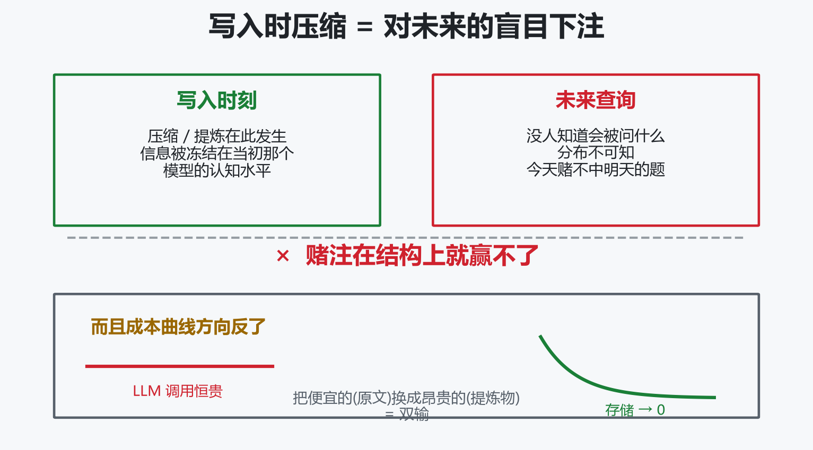
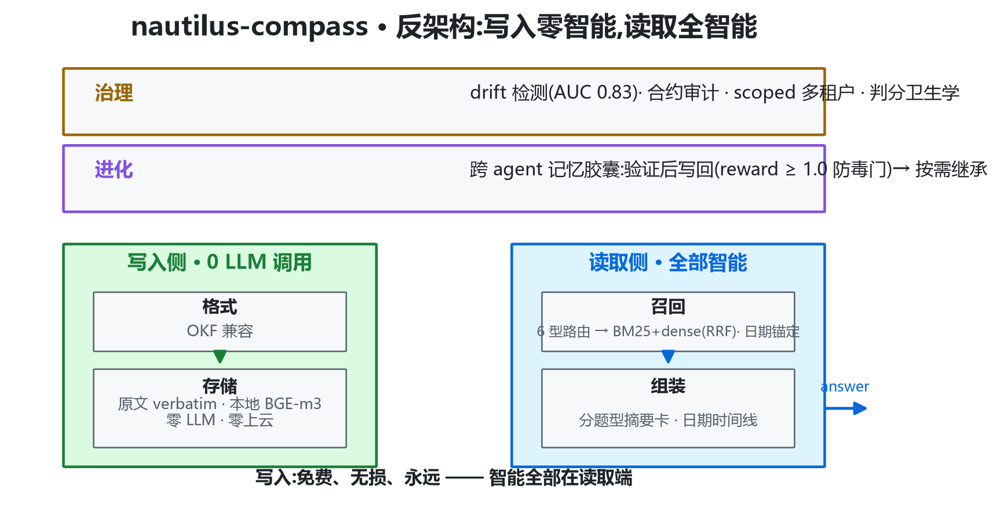
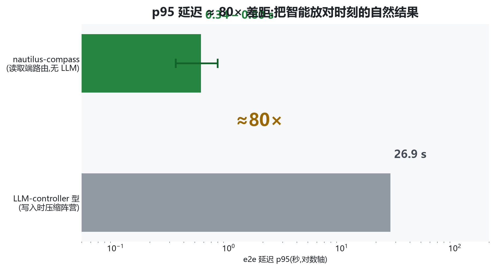
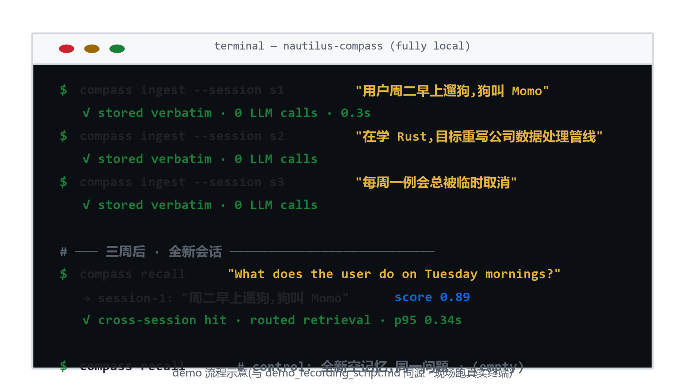
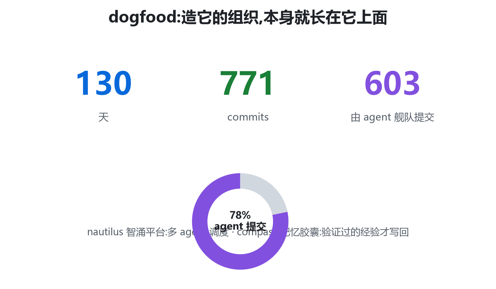

<!-- _paginate: false -->

<!-- _class: lead -->

# Don't Summarize the Past<br>for a Future You Can't Predict

## nautilus-compass · 技术深讲版(30 min)

*Chunxiao Wang · 2026-09*
*github.com/chunxiaoxx/nautilus-compass*

**写入 0 LLM 调用 · e2e 42.6% → 75.4% · p95 快 80× · 判官病理学**

<!-- 讲者注:深讲版 40 页 ≈ 30 分钟。15 分钟版裁法见末页。今天的目标:听众多带
走三件事——写入零 LLM 的架构赌注、判官三型病理学、以及我们怎么对待自己的数字。 -->

---

<!-- _class: part -->

# 第一幕 · 问题与立场

---

# 你的 agent 正在忘记你



<!-- 讲者注:建立问题,不亮方案。问观众:你们的 agent 记得你上周说过什么吗?
ChatGPT 随对话推进覆写关键信息(ICLR 2025 LongMemEval 论文 Appendix B 人肉研究);
长上下文直读性能掉 30-60%。 -->

---

# 市场现状:三大策略,同一个死穴

| 策略 | 谁在做 | 何时做有损决定 |
|---|---|---|
| 压缩 | 多数 SaaS 记忆层 | **写入时** |
| 提炼/摘要 | mem0 / Zep / Letta | **写入时** |
| 裸读长上下文 | 直塞 context window | 牺牲性能(掉 30-60%) |

> 全部在**写入时**对未来下注 —— 没有人把宝押在读取端

<!-- 讲者注:指着右列"写入时"打三遍。裸读不是候选,是基准的失败下限。 -->

---

# 三不变量:为什么写时压缩必输

1. **未来查询分布不可知** —— 重要性只在被问到的时刻显影。实证:同一份记忆,按题型切换检索粒度,P@1 0.20 → 1.00;**变的不是记忆,是问题**
2. **原文是唯一可重新索引的表示** —— 提炼物被冻结在当初那个 LLM 的认知水平;原文明天可换更好 embedder、可作训练燃料
3. **成本曲线方向反了** —— 存储趋零、LLM 调用恒贵;把便宜的(原文)换成昂贵的(提炼物)是逆成本曲线

<!-- 讲者注:不变量 2 有一句最狠的话:写时压缩不只丢信息,它把记忆锁死在技术现状里。
停两秒再翻页。 -->

---

# 第三方背书:不是我们自己说

**ICLR 2025 · LongMemEval 基准论文(arXiv 2410.10813)**

- §5.2:用 LLM 提炼的摘要/facts 替代原文 → **因信息丢失损害 QA**
- Appendix B 人肉研究:ChatGPT 压缩历史时覆写关键信息,Coze 漏记间接提及
- 长上下文直读掉 30-60% → 裸读是死路,记忆层必要性由基准作者论证

<!-- 讲者注:这页防"王婆卖瓜"。基准作者在 2024 年就把写时压缩的损害量化了,
我们是第一波把"读侧路线"量出胜绩的团队之一。 -->

---

<!-- _class: part -->

# 第二幕 · 架构

---

# 反架构:写入零智能,读取全智能



<!-- 讲者注:六层结构来自 ARCHITECTURE.md。强调"写入不调 LLM"停两秒。
治理层是我们独有件:drift 检测 AUC 0.83 + scoped token 三层隔离 + 判分卫生学。
进化层标注纪律:三次实测 uplift=0 → 保持"待证",不冒充已验证。 -->

---

# 生态定位:从 nautilus 平台长出来的组件

- 起源:nautilus 智涌平台 agent 舰队需要跨 agent 记忆层 → compass 保持 **dogfood**
- 平台 Trinity 三层架构中对应**记忆与治理层**的独立开源形态
- **独立组件,不依赖平台**:本地三条命令完整运行
- 130 天 771 commits,其中 603 由 agent 舰队提交——组织日常跑在上面

<!-- 讲者注:这页回答"这项目哪来的"。平台理论基础(Epiplexity/DMAS)一句带过,
深讲聚焦 compass 自身。dogfood 是产品最硬的证明,这里埋点,结尾收。 -->

---

# 写入端决策表

| 决策 | 内容 | 理由 |
|---|---|---|
| 存什么 | **原文 verbatim**(md+frontmatter+`[[链接]]`) | 不变量 2 |
| 怎么索引 | 本地 BGE-m3 dense + BM25 + 日期元数据 | 三路互补:词面扛标识符/dense 扛语义/日期扛时序 |
| 不做什么 | **零 LLM**:不提炼、不建图、不摘要、不上云 | 不变量 1+3 |
| 质量门 | 胶囊写回需 reward ≥ 1.0 | 验证过的经验才入库,防跨 agent 复利成毒 |

<!-- 讲者注:"不做什么"比"做什么"更难被抄——因为它是立场不是功能。 -->

---

# 架构决策记录:放弃过什么(负结果公开)

| 被放弃的方案 | 结果 | 教训 |
|---|---|---|
| 图数据库 Neo4j + graph rerank | 检索 **-6.2pt** | 图边引入噪声;复杂度做减法 |
| cross-encoder reranker | e2e **-2pt** | 嵌入自身排序已更好,叠床架屋 |
| 大 K(K=50 vs 20) | **无差异** | 无 reranker 时 K 只加宽 RRF 窗口 |
| 小嵌入模型 Qwen3-0.6B | **wash**(P@5 0.833 vs 0.867) | 嵌入质量是地基 |
| LoRA 域适配 embedder | 代理指标涨,**e2e 平** | 预注册 +5pt 门没过就不上 |
| abstention gate 主动拒答 | 误拒 web 92 题(门≤1) | 打掉的是噪声不是错误 |

<!-- 讲者注:这页是"系统与深度"的核心证据页——每个负结果都是真金白银跑出来的,
预注册文件带 hash 可查。复杂度做减法不做加法,是被证伪逼出来的,不是品味。 -->

---

<!-- _class: part -->

# 第三幕 · 算法解剖

---

# 六型分型路由:问题先分类,检索再定粒度

| 型 | 全称 | 策略 | 基线 → 终局 |
|---|---|---|---|
| ssu | single-session-user | turn 级块(滑动窗 2) | 0.957 → **0.971** |
| ssp | single-session-preference | turn 级块 | 0.800 → **0.800** |
| ku | knowledge-update | turn 级块 | 0.731 → **0.808** |
| ssa | single-session-assistant | 摘要卡 | 0.250 → **0.839** |
| ms | multi-session | 摘要卡 | 0.226 → **0.692** |
| tr | temporal-reasoning | 摘要卡+日期时间线 | 0.158 → **0.624** |

**ssu/ssp/ku 的 context 字节不变** —— 不碰强项,改动集中在三弱型

<!-- 讲者注:设计逻辑一句话:用户陈述型答案通常在一个 user turn 里——检 turn 级;
跨会话/助手行为/时序型需要"每场会话发生了什么"的地图——路由到逐会话摘要卡。
tr 62.4 是已知短板,主动讲。 -->

---

# 归因链:42.6 → 75.4,每一步

| 步 | 数字(full / 剔除断连) | 改动 |
|---|---|---|
| 500 题基线(8/29) | **42.6%** / — | dense+BM25 RRF(k=60)+日期锚定+四型 utterance context |
| 摘要层 A 臂(9/3) | **70.0%** / 81.6% | 三弱型路由摘要卡;9/2 预注册三态门,三型全过 |
| 判官断连重判(9/4) | **75.4%**(377/500)/ 81.6% | 71 题曾被网关故障记错,同判官同 prompt 仅加重试 |

净 **+32.8pt** = 方法效应 **27.4pt** + 测量修正 **5.4pt**

<!-- 讲者注:这页是全场最重要的一页。把"方法带来多少"和"修测量仪带来多少"分开报
是评测写作最常见的自我欺骗,我们把它拆开——5.4pt 不是方法效应,是仪器修复。
预注册门:ms≥35%(锚22.6)/ssa≥40%(锚25.0)/tr≥30%(锚15.8),跑数前落仓带 hash。 -->

---

# 三口径:同一次跑的三个数字

| 口径 | 数字 | 含义 |
|---|---|---|
| 保守(断连记错) | 0.700 | 下界 |
| 重判后(同判官+退避) | **0.754** | 发布口径 |
| 干净(剔 71 断连题,n=429) | 0.816 | 上界 |

> 只报一个数 = 替听众做决定;三口径并报 = 把决定权还给听众

<!-- 讲者注:71/71 重判解决,其中 27 题翻对——注意重判解决≠全变对,
21 个本来就是错答,这就是"断连≠正确"的诚实注记。 -->

---

# 检索层演进:0.784 → 0.890,赢在路由不赢在嵌入

| 版本 | P@1 | 增量来源 |
|---|---|---|
| m3-only(K20 混合) | 0.784 | 与 mem0(0.774)打平——纯基建不赢 |
| + ssu/ssp 分型路由 | 0.848 | 单会话型切 turn 级 |
| + ku 路由 | 0.876 | 知识更新型切 turn 级 |
| + 日期锚定 | **0.890** | tr P@1 0.83→0.88;P@5 0.978 / MRR 0.929 |

<!-- 讲者注:首版和 mem0 打平这句主动说——中间态如实公开是可信度的一部分。
最终 P@5 0.978 / MRR 0.929 三项全赢。 -->

---

# 检索对打:实验设置逐字段

- **同题**:LongMemEval-S 全 500 题,按 question_id join
- **同判据**:retrieval-only 双方;mem0 `infer=False`(纯检索,不开 LLM 提炼)
- **各用默认嵌入**:我方 BGE-m3 / mem0 复现 vertexai text-embedding-005
- **版本钉死**:mem0ai 2.0.19(8/27 pip 核对 PyPI 最新)
- 结果:P@1 **0.890 vs 0.774**,P@5 **0.978 vs 0.916**,MRR **0.929 vs 0.834**

> 诚实披露:对方嵌入在部分单会话型更强;我们靠分型路由整体赢。
> **"同题同判据"成立,"同嵌入"不成立也无需成立** —— 开箱对打才是用户真实场景

<!-- 讲者注:嵌入这页如果被问,答案是"比的是开箱即用的检索层,不替对方换嵌入"。
复现:一条命令 scripts/reproduce_lmes_retrieval.sh,~$3.50。 -->

---

<!-- _class: part -->

# 第四幕 · 判官病理学

<!-- 讲者注:接下来 6 页是 paper2(arXiv 在投)的内容。
开场自嘲:"这部分讲我们怎么抓自己判官——抓了 5 次,全是配置问题,零次模型能力问题。" -->

---

# 判官失败 = 资源耗尽:三型 taxonomy

部署中的判官是 J*(θ, B, I):知识边界 θ · 输出预算 B · 打分基础设施 I

| 型 | 检测信号 | retry 可治? | 可部署前检出? | 分数效应 |
|---|---|---|---|---|
| **J-K** 知识边界 | Δ 探针集 | 否 | 是 | 静默放过错误 |
| **J-B** 输出预算 | 截断/空响应率 | 否 | 是 | 塌缩到默认标签 |
| **J-C** 连接 | 错误标签率 | **是** | 仅运行中 | 假性错答(下界) |

> 三型机制不同、信号不同、解药不同 —— 混为一谈必然用错药

<!-- 讲者注:传统 judge bias 文献(位置偏差/冗长偏差)是"判官在读,但读歪了";
我们这三型是"判官没在读/没来得及说/根本没被叫到"——不同的物种。 -->

---

# J-K:数值精度盲区(2,600 次真实 API 调用)

- 双判官族(Kimi k3 / MiniMax-M3),注入数值误差的通过率**随幅度单调下降**:

| 判官 | ±0.1% | ±1% | ±10% |
|---|---|---|---|
| Kimi k3 | **48%** | 14% | 0% |
| MiniMax-M3 | **37%** | 12% | 0% |

- 盲区在"事实性要求已写入判分 prompt"的前提下**仍存在**;换更强判官没用(跨族差 ≤11pp)
- 判官能抓的:实体替换/常识错误/文风夸大全部 0% 通过 —— 是数值盲区,不是普遍轻信

<!-- 讲者注:珠峰 8849→8949 米、光速 3.0→3.1×10⁸——±0.1% 的污染,四成通过。
局限也讲:两判官均为 reasoning 模型,对非 reasoning 架构泛化未测;prompt 变体消融未做。 -->

---

# J-B:预算饥饿的判官(生产事故 ①)

- reasoning 判官 `max_tokens=4096` 被**思考过程吃满**,截断输出解析为默认标签
- ent 域 **146/211 题(69%)记 0**,raw 日志 250 次空响应
- 连续**两轮调优被误判为"方法未过门"** —— 测量坏了,方法背锅
- 重判(16384/low):web **+3.3pt** / ent **−1.9pt** —— 方向相反,不重判就带错发布

> 解药 = 部署时冒烟:真实尺寸条目上断言判官输出非空可解析

<!-- 讲者注:为什么两轮都没发现?spot check 用的都是短条目,推理装得下预算;
坏的是长条目——系统性的。方向相反这个细节要强调:修正的符号不可假设。 -->

---

# J-C:断连的判官(生产事故 ②)

- 500 题生产跑,**71 题(14.2%)** 由间歇 403/超时网关后的判官"判分"——中止调用被记为错答
- 整轮重试未清零(新题继续命中)= 随机基础设施故障,非题目绑定
- 失真 **5.4pt ≈ 被测真实效应(32.8pt)的 1/6**
- 中期一次"-20pt 子型回归"事后证实**全部**是断连误标

> 基础设施噪声可以吞掉六分之一的被测效应 —— 还能制造幻影回归

<!-- 讲者注:这一页的推论最吓人:如果你的预注册门设在 ±5pt,
一次网关抖动就能翻转 accept/reject 决定。逐题判官输出审计不是奢侈,是必需。 -->

---

# Hygiene Protocol P1-P5(成本 ≈ 几次 API 调用)

1. **P1 预注册锚与门**:跑数前冻结锚/门/裁决规则,版本化+hash
2. **P2 同判官重判退避**(J-C 解药):只重试打分调用,答案原样复用;仍败的报告不丢弃
3. **P3 多口径披露**:保守/重判后/干净三口径并报;口径不一致本身就是发现
4. **P4 部署冒烟**(J-B 解药):真实条目、非空断言、预算审计、配置变更后重跑
5. **P5 二项噪声带**:n=30 上一题=±3.3pt;带内"回归"推迟到逐题审计

> 六相 checklist:部署前 Δ 探针+冒烟 / 跑前预注册 / 跑中签名率监控 / 跑后重判+多口径

<!-- 讲者注:协议的每个条款都对应一次真实事故——5 次:401 变量名/断连/预算吃满/
空响应/子型幻影回归。全部是配置层。测量可信度先于分数。 -->

---

<!-- _class: part -->

# 第五幕 · 评测版图

---

# 五个战场各测什么(组合逻辑)

| 战场 | 性质 | 回答的问题 |
|---|---|---|
| LME-S e2e 500 题 | 自建 harness 主场 | 方法效应:42.6 → 75.4 |
| 检索对打 mem0 | 同题同判据 | 相对优势:0.890 vs 0.774 |
| LOCOMO-10 客场(n=1986) | 换数据集 | 泛化:0.644 vs 0.592 |
| EverMemBench 第三方榜 | 别人的卷子 | 防自吹:44.4-47.3 vs Mem0 37.09 / Zep 39.97 / MemOS 42.55 |
| LME-V2 官方基准(451 题) | 社区坐标系 | 可比性:40.0/38.4(untuned 19.6/12.8) |

> 单一战场都可被质疑;组合的覆盖面难以全部归为"自选有利"

<!-- 讲者注:EverMem 主动用首轮 44.4 作头条防挑样(Run2 47.3,CI 42.9-51.7);
不 claim industry SOTA,榜单口径以官方 Table 4 为准。 -->

---

# LME-V2:调优记录与判分修正

| 步 | 内容 | 效果 |
|---|---|---|
| untuned(8/30) | 首跑基线 | web 19.6 / ent 12.8 |
| 刀1 abstention 口径 | 禁裸 UNKNOWN,引导两条合法得分路线 | abstention 组 web 2.8→45.8 / ent 0→83.9 |
| 刀2 检索单元升级 | 空结构行剪枝+轨迹内重排+预算 12k→24k | gold-在场 ent 0.115→0.652(倒挂修复) |
| d13 判分修正 | judge 4096→16384 重判 | web 36.7→**40.0** / ent 40.3→**38.4** |

attribution:上游官方基准(xiaowu0162/LongMemEval-V2,Di Wu 等)——**题目/轨迹归上游,不抢功**

<!-- 讲者注:刀3(LoRA)没进表,因为预注册门没过未采纳——负结果也记录。
attribution 是红线:451 题是上游官方基准,我们提交的是成绩+调优栈+判分协议。 -->

---

# 官方坐标系里的诚实定位

官方 Small Overall(gpt-5.2 judge + 200k 预算):No retrieval 1.3 / RAG **42.8** / RAG+notes 51.0 / AgentRunbook-R 58.6(26.9s)/ Codex 69.9(177s)/ AgentRunbook-C 74.9(108s)

**compass ≈ 39.3 —— 与最弱 RAG 基线相当,不是优势**

- 差距两结构性来源:预算 24k vs 200k(8.3×);判分口径(全题 LLM judge vs 程序化为主)
- 我们的差异化:**延迟**(0.165-0.328s vs 26.9s)+ 判分卫生学贡献
- 主攻坚 = 三池设计移植,目标 Small 55-60%(超 AgentRunbook-R)后再上官方榜

<!-- 讲者注:这页最反营销——主动把自己的官方坐标位置说成"与最弱 RAG 相当"。
把"我们在哪里"说清楚,比把 40.0 说成大胜更有信用。听众此刻的信任峰值在这页。 -->

---

<!-- _class: part -->

# 第六幕 · 安全与多租户

---

# 三层身份模型 + scoped token

```
user(JWT 身份)→ 设备 → agent(scoped token: read:<project> / write:<project>)
```

- 隔离边界 = project 命名空间;header-only 身份(X-User-ID 类)**永久禁止**
  —— v0.9 曾有冒充洞(公网可冒充任意用户读写),已改 JWT-only + 五项矩阵验证
- 自助 token 只含持有者自己的空间;缺省 project 显式注入持有者 uid
- 公网自助 token 只见 8 个用户工具(tools/list 17→8),内部工具直调 forbidden

<!-- 讲者注:冒充洞主动讲——我们是自己抓的、自己修的、验证矩阵公开的。
抓自己的洞比藏起来便宜:发现那周如果被别人发现,故事就完全不同了。 -->

---

# 四探针:隔离不是声明,是可重跑的生产事实

| 探针 | 断言 |
|---|---|
| P1 | A 的 token 读 B 的空间 → forbidden |
| P2 | A 的 token 写 B 的空间 → forbidden |
| P3 | A 的 token 读写 A 自己的空间 → 放行(不误伤) |
| P4 | 撤销 token → 下一次调用立即 401 |

**脚本开源(probes.py),任何人对生产端点可重跑** · 发布流程规定 FOUR-GREEN 才发帖

<!-- 讲者注:9/4/9/5 两次生产变更后各复验一轮全绿——隔离属性是持续重验的事实,
不是一次性的安全审计报告。 -->

---

<!-- _class: part -->

# 第七幕 · 价值与收尾

---

# 延迟:80× 差距从哪来



**不靠 cache,不靠捷径 —— 智能放在了不花钱的时刻**

- memory_query p95:web 0.339s / ent 0.798s vs AgentRunbook-R(LLM controller)**26.9s**
- 诚实注记:max 尾部(web 23.8s/ent 50.9s)= 冷启动/索引进场,非稳态

<!-- 讲者注:对交互式 agent,亚秒检索与 27 秒等待不是同一可用性等级。
生产读吞吐 ≈5 rps 天花板在嵌入 daemon 串行推理——已在路线图,不藏。 -->

---

# 成本账

- **写入 0 token**:每条记忆零 LLM 调用 —— 写时提炼方案的按条边际成本,在这里是零
- **复现成本 ≈$3.50**:LLM ≈¥7(5M in + 0.5M out,DeepSeek)+ T4 spot 8h ¥3.20 + 网络/冷启 ≈$1 · 约 8h 墙钟
- 诚实注记:竞品每条记忆的写入成本无我方实测(闭源)——"写入免费"是我方可验证的事实,对方的成本不是我方断言

> 只对自己可验证的事下断言 —— 这条纪律本身就是成本账的一部分

<!-- 讲者注:$3.50 是 v0.8 时代实测口径,BENCHMARKS_REPRODUCE.md 有完整 breakdown。
竞品成本那句是防"你们凭什么说别人贵"的先手。 -->

---

# 路线图与开放问题(诚实版)

| 期 | 事项 |
|---|---|
| 发布窗口 | hosted beta 邮箱验证门禁 / PyPI 3.1.1 / MCP 目录提交 |
| 主攻坚 | 三池设计移植,目标 LME-V2 Small 55-60%(当前 ≈39.3,与最弱 RAG 相当) |
| 工程 | 嵌入 daemon 并行化(读吞吐 ≈5 rps 天花板根因) |
| 待证 | 进化层 tier 晋升 uplift 三次实测为 0,重测前不动 |
| 开放问题 | tr 62.4 仍是短板 · J-K prompt 变体消融未做 · 非 reasoning 判官泛化未测 · **hosted 外部真实用户案例为零** |

<!-- 讲者注:最后一行故意留在屏上三秒。外部案例为零是今天最大的未知数——
我们用 dogfood 和可复现性兜底,但它只有经过外部用户才能证伪。 -->

---

# Demo:跨会话记忆(现场 live)



**三个会话各说一件事 → 三周后新会话,只有跨会话才能答的问题 → 命中**

<!-- 讲者注:现场跑真实终端;环境故障切录屏(1080p 已备)。
对照组:空白记忆同一 query → 空。按 demo_recording_script.md 分镜。 -->

---

# 三档接入,一个承诺

| 路径 | 适合谁 | 成本 |
|---|---|---|
| **本地三条命令** | 隐私/成本敏感 · 单机 agent | 永久免费,数据不出机器 |
| **Hosted beta** | 快速试用 · 团队 | compass.nautilus.social 自助 signup |
| **私有化** | 组织部署 | 联系我们 |

- 写入 **0 token** · 召回 0 上云 · BGE-m3 本地嵌入
- Modified MIT:自部署/内部/个人**永久免费** —— 开放程度用行为定义,不用标签

<!-- 讲者注:行为定义=全源码+$3.50 复现+evidence 链+四探针可重跑。 -->

---

# One developer. 130 days. No cloud required.



- 130 天 771 commits,**603 由 agent 舰队提交**
- 记忆胶囊跨 agent 继承实录:agent A 解题 reward 1.0 → 写胶囊 → agent B 从 FAIL → PASS

```bash
git clone https://github.com/chunxiaoxx/nautilus-compass ~/.claude/plugins/nautilus-compass
bash ~/.claude/plugins/nautilus-compass/install.sh && bash ~/.claude/plugins/nautilus-compass/daemon_start.sh
```

<!-- 讲者注:结尾停在这句。深讲版收尾回到 dogfood——架构、算法、病理学都是
这个组织日常的一部分,不是论文装点。 -->

---

# (备用页)常问问题

- **mem0 自报 94.4% vs 你们 75.4%?** 口径不同不可比;硬对打=同题同判据检索层 +11.6pt
- **嵌入不一样也算对打?** 各用各的默认嵌入=开箱即用对打;对方嵌入部分单会话型更强,我们靠路由整体赢
- **判官是自己请的,分数可信吗?** 正因如此才有判官病理学:三口径并报+重判工具开源+5 次事故全录
- **为什么不是纯开源?** Modified MIT:全源码+$3.50 复现+四探针可重跑;自部署永久免费

---

## 版本与裁剪

- 30 分钟版 = 全部 40 页;**15 分钟版**:保留第一幕(4 页)+ 算法解剖归因链/对打(4 页)+ 判官三型/断连(3 页)+ 诚实定位(1 页)+ 四探针(1 页)+ 成本账/路线图/demo/收尾(4 页)
- 5 分钟路演 = 用 pitch_deck_20260904.md(19 页发布版)
- 内容正本: whitepaper_20260905.md(白皮书 v1.1)· 数字口径: docs/nautilusmem/SCOREBOARD.md
- 重渲染: `npx @marp-team/marp-cli pitch_deck_deepdive_20260905.md -o <out> --allow-local-files`
