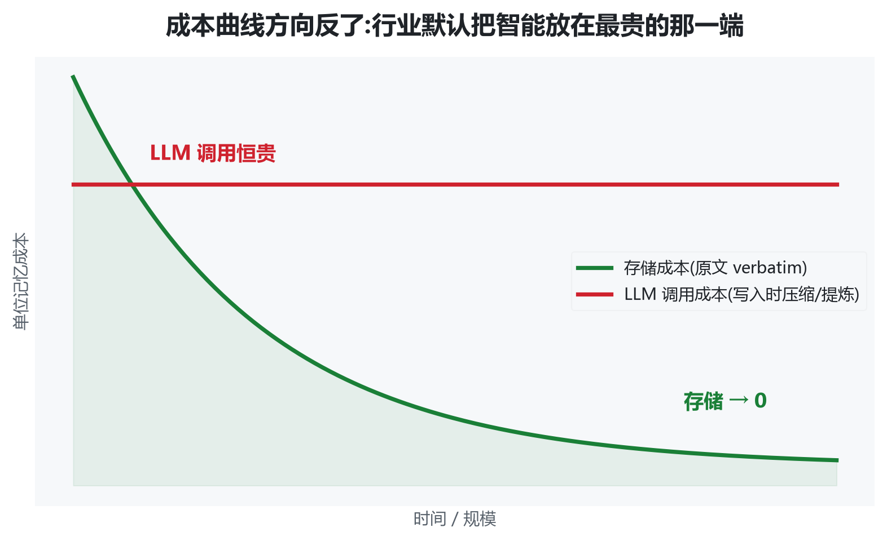
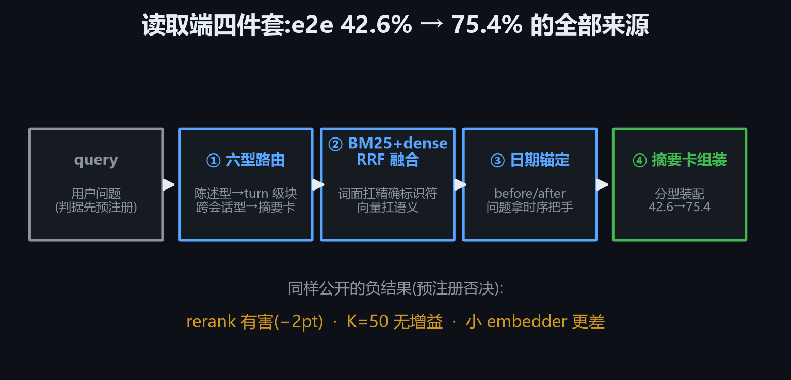
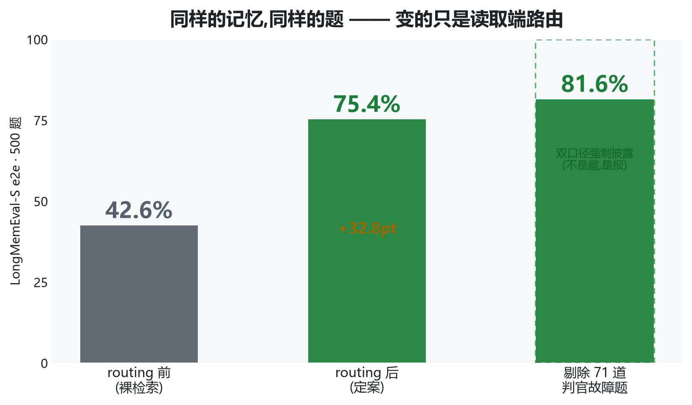
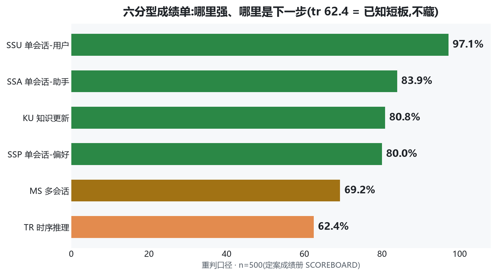
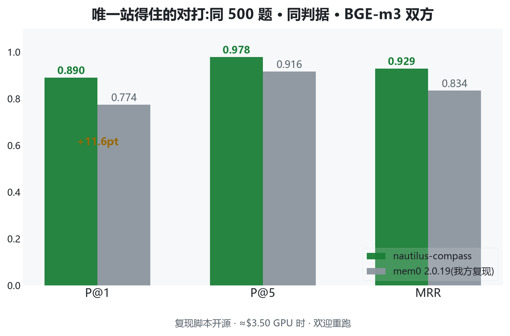
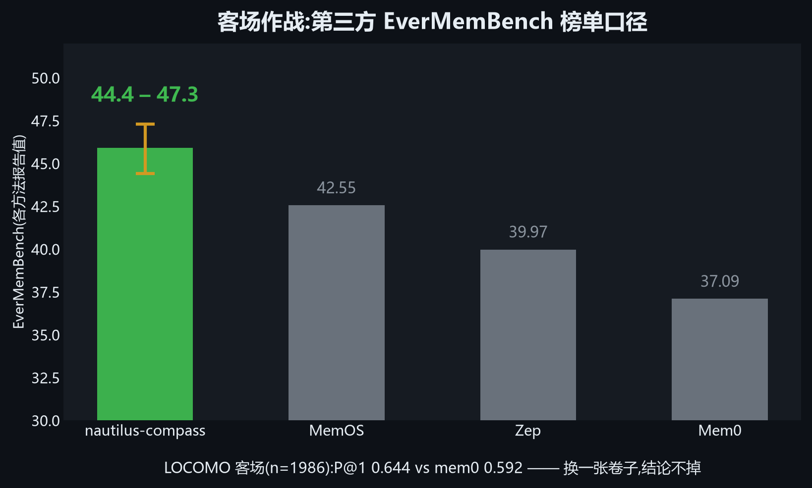
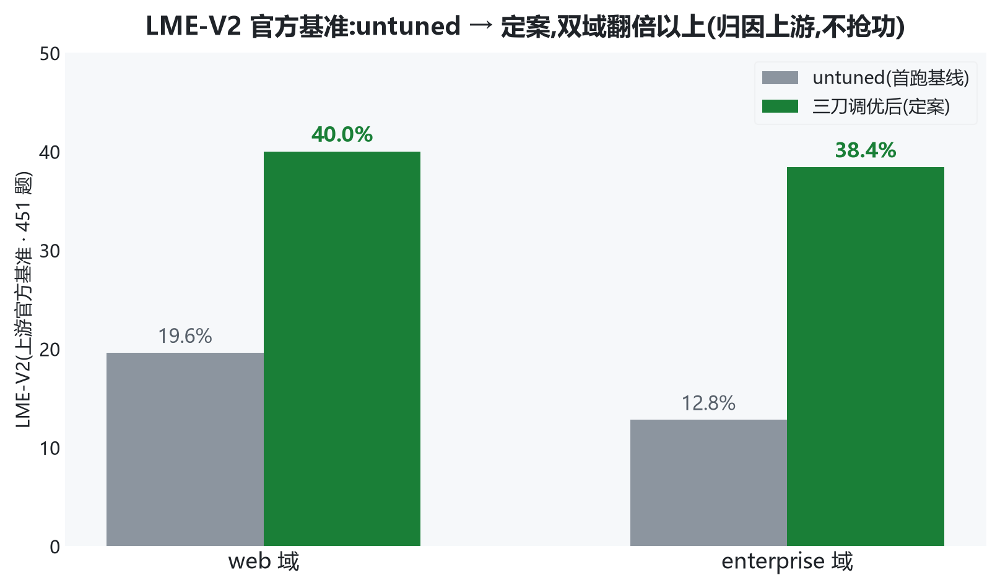
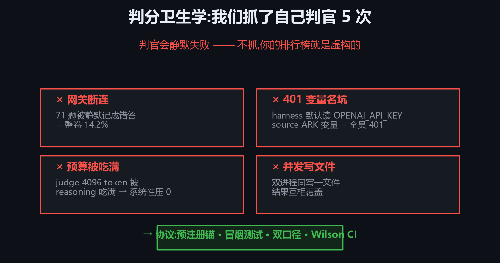

<!-- _paginate: false -->

<!-- _class: lead -->

# Don't Summarize the Past<br>for a Future You Can't Predict

## nautilus-compass · agent memory

*Chunxiao Wang · 2026-09*
*github.com/chunxiaoxx/nautilus-compass*

**写入 0 LLM 调用 · e2e 42.6% → 75.4% · p95 快 80×**

<!-- 讲者注:开场 30 秒停顿,让标题被读完。这句是全文论点。 -->

---

# 你的 agent 正在忘记你


<!-- 讲者注:这一页只建立问题,不亮方案。问观众:你们的 agent 记得你上周说过什么吗?
ChatGPT 会随对话推进覆写关键信息(ICLR 2025 LongMemEval 论文·人肉研究);长上下文直读性能掉 30-60%。 -->

---

# 市场现状:三大策略,同一个死穴

| 策略 | 谁在做 | 何时做有损决定 |
|---|---|---|
| 压缩 | 多数 SaaS 记忆层 | **写入时** |
| 提炼/摘要 | mem0 / Zep / Letta | **写入时** |
| 裸读长上下文 | 直塞 context window | 牺牲性能(掉 30-60%) |

> 全部在**写入时**对未来下注 —— 没有人把宝押在读取端

<!-- 讲者注:表格别逐行念,指着右列"写入时"三个字打三遍。 -->

---

# 反架构:写入零智能,读取全智能


<!-- 讲者注:六层结构来自 ARCHITECTURE.md。强调"写入不调 LLM"停两秒。
进化层防毒门:reward ≥ 1.0 的经验才写回胶囊。 -->

---

# 三不变量(为什么写入时压缩必输)



1. **未来查询分布不可知** —— 同一份记忆,分型路由让 P@1 从 0.20 → 1.00;变的不是记忆,是问题
2. **原文是唯一可重新索引的表示** —— 更好的 embedder 明年发布?提炼物吃不到红利,原文可以
3. **成本曲线方向反了** —— 我们 p95 **0.34-0.80s** vs LLM controller **26.9s**(~80×)

---

# 读取端四件套



<!-- 讲者注:42.6→75.4 的全部来源就是这四步,没有其他魔法。
负结果同样预注册:rerank 有害(-2pt)· K=50 无增益 · 小 embedder 更差。 -->

---

# 证据 ①:e2e 主战场



**同样的记忆,同样的题 —— 500 题,e2e 42.6% → 75.4%**

<!-- 讲者注:81.6% 是剔除 71 道判官故障题的口径,双口径强制披露。
判据先于跑数预注册,预注册文件带 hash 落仓。 -->

---

# 证据 ②:六分型成绩单



<!-- 讲者注:tr 62.4 是已知短板,主动讲 —— 不藏短板是可信度的一部分。
ssu 97.1 说明单会话用户事实几乎全对;tr 是时序推理,检索型方案的天然硬骨头。 -->

---

# 证据 ③:同题同判据对打



**mem0 2.0.19 我方复现 · 同题同判据 · 脚本开源 ≈$3.50 重跑**

<!-- 讲者注:如果有人只记一页,记这页。强调"同题同判据"四个字。
跨 harness 分数不可比 —— mem0 自报 94.4% 是他们的 harness/判官/口径,不比。
备询:嵌入各用各的默认(我方 BGE-m3 / mem0 text-embedding-005),对方嵌入在部分单会话型更强,我们靠分型路由整体赢。 -->

---

# 证据 ④:客场作战



<!-- 讲者注:EverMemBench 是第三方榜,不是我们出的卷子。
LOCOMO n=1986:P@1 0.644 vs mem0 0.592 —— 换一张卷子,结论不掉。
LME-M 检索 P@5 0.888,证据册里有,口头补。 -->

---

# 证据 ⑤:官方基准 LME-V2



**451 题双域 · 上游官方基准(xiaowu0162)· 归因上游,不抢功**

<!-- 讲者注:主动说清 LME-V2 是上游官方基准,我们提交的是成绩+调优栈。
untuned 19.6/12.8 → 定案 40.0/38.4。 -->

---

# 延迟:80× 差距从哪来


**不靠 cache,不靠捷径 —— 智能放在了不花钱的时刻**

<!-- 讲者注:26.9s 是写入时压缩阵营调用 LLM controller 的 p95(同口径对比)。
我们读取端纯检索+组装,无 LLM 调用,所以 p95 0.34-0.80s。 -->

---

# 判分卫生学:我们抓了自己判官 5 次



<!-- 讲者注:自嘲式讲,这一段最圈粉。一次断连把 14.2% 的题静默记成错答,方向曾完全相反(web +3.3 / ent −1.9)。
这是 paper2(arXiv 在投)的主题:判官盲区是这个领域的 meta-problem。 -->

---

# 预注册文化:否决自己也是产出

- LoRA 检索增强:代理指标涨,端到端平 → **关闭**
- abstention gate:误拒答 92/89 题 → **预注册拒收**
- cheap-tier 三改组合:双域未超现役 → **关闭**

> 拒绝噪声改进,和拿到提升一样,是结果

<!-- 讲者注:每条都是真金白银跑出来的负结果,预注册锚+hash 可查。 -->

---

# dogfood:我们自己的组织跑在上面


<!-- 讲者注:nautilus 智涌平台多 agent 调度,compass 是吃狗粮产物。
跨 agent 记忆胶囊:agent A 解题 reward 1.0 → 写胶囊 → agent B 直接继承(B 从 FAIL→PASS 的实录)。 -->

---

# Demo:跨会话记忆(现场 live)


**三个会话各说一件事 → 三周后新会话,只有跨会话才能答的问题 → 命中**

<!-- 讲者注:现场跑真实终端;若环境故障切录屏(1080p 已备)。
对照组:空白记忆同一 query → 空。录屏兜底按 demo_recording_script.md 分镜。 -->

---

# 三档接入,一个承诺

| 路径 | 适合谁 | 成本 |
|---|---|---|
| **本地三条命令** | 隐私/成本敏感 · 单机 agent | 永久免费,数据不出机器 |
| **Hosted beta** | 快速试用 · 团队 | compass.nautilus.social 自助 signup |
| **私有化** | 组织部署 | 联系我们 |

- 写入 **0 token** · 召回 0 上云 · BGE-m3 本地嵌入
- Modified MIT:自部署/内部/个人**永久免费**

<!-- 讲者注:价值主张一句话:把记忆从"按 token 交租"变成"一次部署,免费无限"。 -->

---

# 接入(30 秒版)

```bash
git clone https://github.com/chunxiaoxx/nautilus-compass \
  ~/.claude/plugins/nautilus-compass
bash ~/.claude/plugins/nautilus-compass/install.sh
bash ~/.claude/plugins/nautilus-compass/daemon_start.sh
```

不想本地跑:**compass.nautilus.social** · 自助 signup → scoped token → 任意 MCP 客户端

## One developer. 130 days. No cloud required.

<!-- 讲者注:结尾停在这句。130 天 771 commits,其中 603 由 agent 舰队提交 —— 产品最硬的证明。 -->

---

# (备用页)常问问题

- **mem0 自报 94.4% vs 你们 75.4%?** 口径不同不可比;硬对打=同题同判据检索层 +11.6pt
- **Modified MIT 是什么?** MIT + 商标保护 + 托管规模上限;自部署/内部/个人永久免费
- **多租户谁验证的?** 四探针脚本开源,任何人对生产端点可重跑
- **为什么不是纯开源?** 全源码可得 + $3.50 复现全链路 + 证据链全公开——开放程度用行为定义,不用标签

<!-- 15/5 分钟版裁剪:保留前 8 页+延迟页+demo 页+接入页。
内容改动后重出:npx @marp-team/marp-cli pitch_deck_outline_20260904.md -o pitch_deck_20260904.pptx -->
