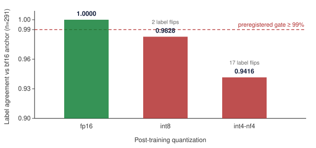

# Quantized Small Judges: A Preregistered Deployment-Precision Study of a Production Verification Judge(v1.0 可投版)

> 目标:arXiv short paper 或官方博客首发(研究空白:无先例同时覆盖 量化×小判分×鲁棒性,四路调研 2026-10-07 确认)。v0.4→v1.0:§2 英文化+Related Work 四实锚引用+References 段。剩:署名口径+投递目标(候用户,开业 10/12 后按传播五层顺序定)。

## Abstract

Small language models are increasingly deployed as verification judges, yet their
robustness to post-training quantization — the default cost-saving step in production —
remains unstudied. We present a preregistered deployment-precision study of a production
three-state verification judge (Qwen3-1.7B + LoRA adapter, 88.5% binary accuracy, ECE
0.072), evaluating four precision configurations × two decoding regimes over 291
held-out cases. Under a preregistered agreement gate (≥99% label agreement with the
bf16 anchor), fp16 passes with **zero label drift** (1.0000), while int8 (0.9828, two
flips) and int4-nf4 (0.9416, seventeen flips) fail the gate. Drift increases
monotonically with quantization strength, corroborating an independent 3B-scale
observation. We release the full per-case judgment matrix, the frozen gating criteria,
and a four-rule deployment discipline for verification judges, and discuss implications
for registry-based self-improving judge systems where a drifting judge silently corrupts
the training signal of the entire loop.

## 1. Introduction

Verification judges — small models that grade the outputs of other models — are
becoming infrastructure: LLM-as-judge pipelines, agent-harness evaluation
services, and self-improving training loops all depend on them. Quantization is
the default cost-saving step when serving such judges in production, yet the
effect of post-training quantization on *judgment stability* has, to our
knowledge, not been studied; a recent survey of small-language-model judges
likewise notes that their robustness is under-examined.

Our perspective is narrower than "do quantized models get worse": a judge in a
registry-based self-improving loop is not a one-off evaluator but **the source
of training signal** — every mis-flip it produces becomes (incorrect) training
data. Quantization drift in such a judge does not merely distort one leaderboard;
it silently corrupts the loop itself. This motivates treating judgment agreement,
not task accuracy, as the primary metric.

We contribute: (1) the first preregistered deployment-precision verdict for a
production judge, with a frozen agreement gate; (2) a four-rule deployment
discipline (bf16/fp16 only for production judges, criteria-freeze, U-state
honesty, two-way judging records); (3) a reproducible methodology with all
per-case artifacts released.

## 2. Setup

- **Judge**: NACRE judge instance v1 — Qwen3-1.7B + LoRA (r16/α32, adapter
  sha16=dbcbab6f…), three-state verdicts (pass / fail / insufficient_evidence),
  production accuracy 88.5% (ECE 0.072).
- **Data**: 291 held-out cases, disjoint from train/dev by qid (leakage-guarded);
  prompts from the training template family with the judge-output channel
  removed (no oracle leakage).
- **Configurations**: {bf16, fp16, int8-bnb, int4-nf4} × {greedy, T=0.3};
  all runs on merged weights (bypassing the peft×bnb hook so the adapter is
  quantized with the base model, matching production serving).
- **Preregistered gate**: a precision is deployable iff greedy label agreement
  with bf16-greedy is ≥99% on the frozen set (tolerance ≤2/291 flips).

## 3. Results

| Config | Three-state acc | Agreement vs bf16 | Gate (≥99%) | Verdict |
|---|---|---|---|---|
| bf16 (anchor) | 0.8797 | — | — | reference |
| fp16 | 0.8797 | **1.0000** | pass | deployable |
| int8-bnb | 0.8694 | 0.9828 (2 flips) | fail | not for prod |
| int4-nf4 | 0.8694 | 0.9416 (17 flips) | fail | forbidden |
| bf16 + T=0.3 | — | 0.9931 | (disclosure only) | keep greedy |

Three observations: (1) drift grows monotonically with quantization strength; (2) an
independent 3B-scale judge showed the same direction (0.8173 at 4-bit), suggesting a
systematic property rather than a model-specific artifact; (3) **agreement must be
measured on parsed labels, not raw output equality** — a verbatim-equality metric
produces all-fail results for any quantized model and would have invalidated the study
had we not caught it during script review.

(Vector master; raster for arXiv: `precor_fig1.png`, 900×560.)

## 4. A Deployment-Precision Discipline for Verification Judges

From these results we distill four rules, all enforced in our production
deployment:

1. **Precision gate.** A judge may serve in production at a given precision iff
   greedy label agreement with the bf16 anchor is ≥99% on a frozen held-out set
   (preregistered; may only be tightened). For our judge: fp16 yes; int8 and
   int4 no.
2. **Criteria freeze.** The gate, the held-out set, and the prompt template are
   sha-anchored before any deployment change; loosening requires re-registration.
3. **U-state honesty.** When the judge cannot decide, it must emit
   insufficient_evidence rather than guess; deployment changes may not trade
   U-rate for accuracy.
4. **Two-way judging records.** Judges err too; every correction feeds an errata
   channel that retrains the judge — which is precisely why rule 1 must hold for
   every redeployment, or the errata loop amplifies noise instead of removing it.

Interaction with registries: judge drift is a systematic noise source in
precedent registries; periodic re-anchoring on held-out sets (our L0–L3 anchor
chain) bounds the drift.

## 5. Related Work

Each neighboring thread examines one face of the problem; none crosses them.
A survey of small-language-model judges [1] flags robustness as under-studied
but does not test quantization. A preregistered study of post-training
quantization [2] (2026) examines welfare-relevant behaviors of general models,
not judges. Rubric-preference-drift attacks (RIPD) [3] show natural-language
rubrics can be manipulated — a concern orthogonal to precision, and one our
criteria-freeze rule partially addresses. Harness-efficiency benchmarks such as
Claw-SWE-Bench [4] measure how well agents perform under evaluation but not
whether the evaluator itself survives deployment changes. Our study sits in
the unoccupied intersection: quantization × small judges × deployment gating,
with the loop-corruption motivation unique to registry-based systems.

## References

[1] *Small Language Models as Judges: A Survey*. OpenReview, 2026.
    (60+ works, SLMs ≤14B; robustness noted as under-examined.)
[2] *Does post-training quantization change welfare-relevant indicators?* —
    A preregistered study. LessWrong, 2026-08-10.
[3] *Rubrics as an Attack Surface: Stealthy Preference Drift (RIPD)*, as
    catalogued in the promptfoo LLM Security Database.
[4] *Claw-SWE-Bench: A Benchmark for Evaluating Coding Agent Harnesses*.
    arXiv:2606.12344, 2026.

## 6. Limitations & Negative Results

Single judge instance: generalization to other judges is claimed only as
direction, not established. Soft-dimension (confidence-tier) agreement data was
lost to an engineering defect in this round (non-incremental CSV write); the
rerun is registered and pending. Per-case flip lists are summarized as aggregate
agreement here; the full matrix is released in the artifact bundle. We also report a
negative methodological result prominently rather than in a footnote: our first
review of a collaborator's replay script revealed a verbatim-equality metric
that would have produced all-fail results for every quantized configuration —
caught only because we re-derived the expected agreement by hand before
running.

## 7. Artifacts

All released and sha-anchored: the frozen criteria document, the
merge-then-quantize runner, the per-case judgment matrix, and run logs, in the
nautilus-compass repository and the nautilus-compass Hugging Face organization.
The judge model card (nacre-judge-v1, adapter sha16 dbcbab6fd1ff5821) carries
the deployment-precision table on its face.

---

**Author**: Chunxiao Wang — nautilus-compass, Nautilus Platform
(chunxiaoxx@gmail.com · correspondence; artifacts: github.com/chunxiaoxx/nautilus-compass · huggingface.co/nautilus-compass)

---
素材源:PRECOR_BC_VERDICT_20261007.md+PRECOR_JUDGE_ROBUST_20261006.md+run.log。
引用锚核实(2026-10-08,WebSearch):[1] OpenReview 2026-05 SLM-judges survey / [2] LessWrong 2026-08-10 量化预注册 / [3] RIPD@promptfoo LLM Security DB / [4] arXiv:2606.12344。
定稿检查单:☑英文全文(§1-7+Abstract 全英)☑引用四实锚 ✏️matrix 图表(PNG 版待转)☑作者/署名(R382 用户拍板 c=个人+组织锚)☑投递目标(R382 拍板 c=双轨:开业周博客短版首发→同周 arXiv 全版)。
